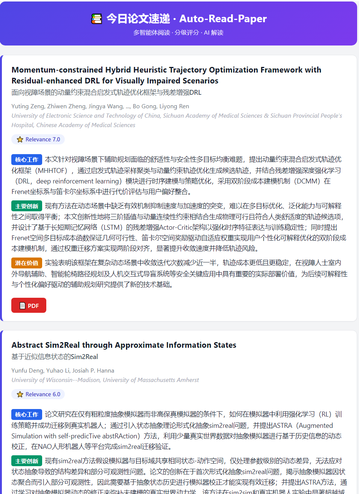
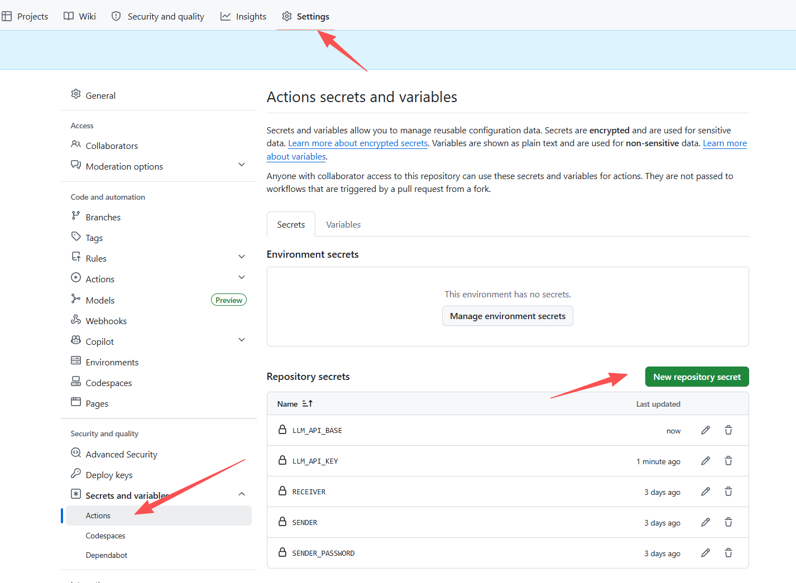
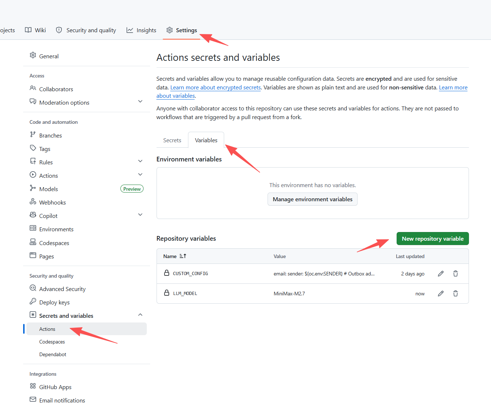
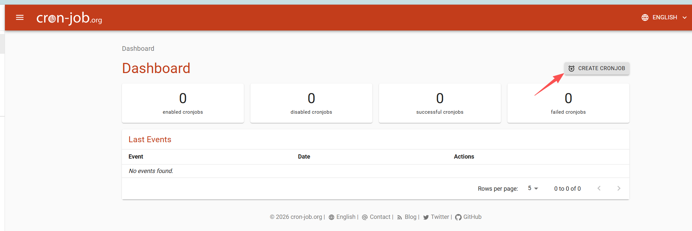
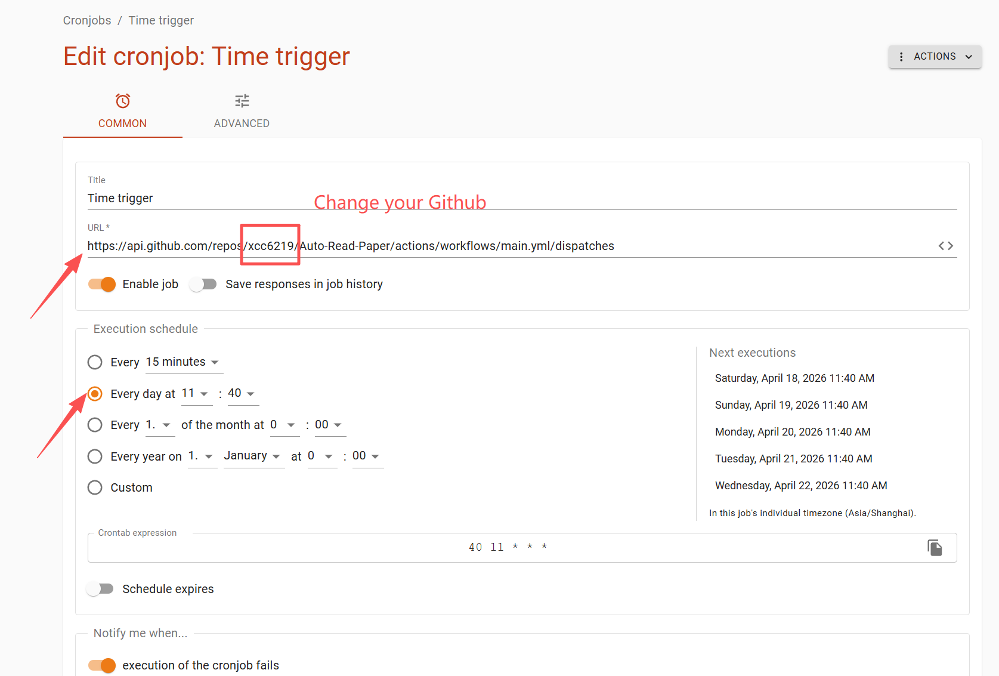
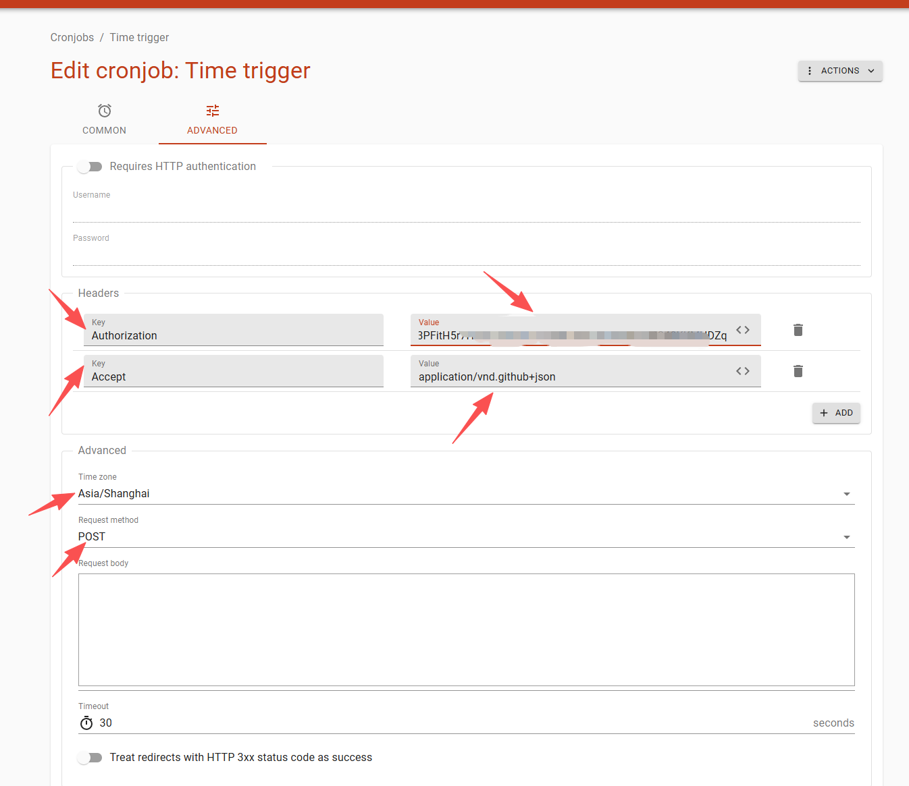
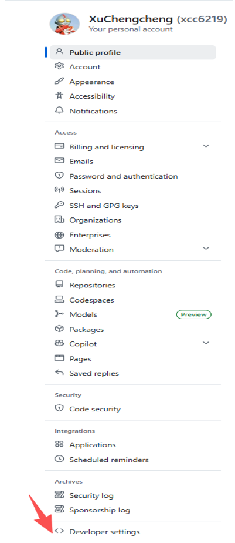
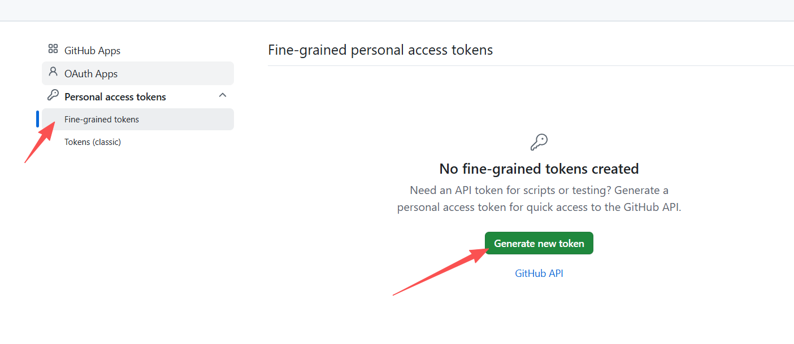
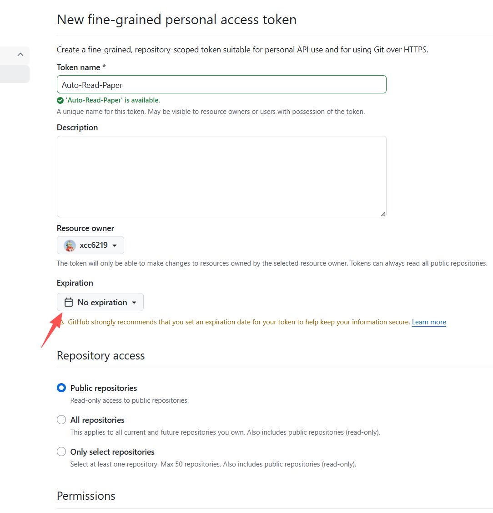

<p align="center">
  <a href="" rel="noopener">
 </a>
</p>

<h1 align="center">📚 Auto-Read-Paper</h1>

<div align="center">

  []()
  []()
  []()
  []()

</div>

---

<p align="center">
<b>Your personal AI paper-reading assistant</b> — automatically fetches fresh arXiv papers daily, runs a <b>multi-agent read-and-review pipeline</b>, remembers unsent high-scoring papers across days, and delivers a <b>bilingual digest with AI commentary</b> straight to your inbox.<br>
Runs entirely on GitHub Actions — <b>no server, free infra on public repos</b>. You only pay for the LLM API tokens your chosen provider bills (typically $0.01–$0.10 / day with gpt-4o-mini / DeepSeek-class models).
</p>

<p align="center"><a href="#-highlights">🌟 Highlights</a> · <a href="#-usage">🚀 Usage</a> · <a href="#-how-it-works">📖 How it works</a></p>

---

## 🌟 Highlights

> Not just a paper crawler — an AI that **reads, grades, picks, summarizes, and remembers** for you.

### 🤖 Multi-Agent Collaboration (core feature)

Unlike the common "score each paper in isolation" approach, Auto-Read-Paper ships with a **Reader + Reviewer two-agent pipeline** by default:

| Role | Responsibility | Output |
|---|---|---|
| 🧑‍🔬 **Reader** | Reads each paper's title, abstract, and a preview of the main body; extracts structured notes (task / method / contributions / results / limitations) | Compact JSON notes per paper |
| 🧐 **Reviewer** | Receives all Reader notes in a single batch, ranks papers globally on a multi-dimensional rubric (**novelty / soundness / effectiveness / completeness / reproducibility / trending**), produces a single 0-10 holistic score | Globally consistent ranking + scores |

**Why is this better than a single agent?**
- ✅ **Global calibration** — the Reviewer sees every candidate side-by-side, so scores don't drift the way they do when each paper is graded in isolation.
- ✅ **Token-efficient** — Reader does a light read per paper; Reviewer does one batched call. Far cheaper than per-paper scoring.
- ✅ **Sharper ranking** — structured notes let the grader focus on real technical differentiation instead of abstract wording.

💡 You can toggle single/multi-agent mode anytime in YAML: `executor.reranker: reader_reviewer` (default, multi-agent) or `keyword_llm` (single-agent, per-paper scoring).

### 📖 Automatic deep-reading & localized AI commentary

Each Top-N paper is **deep-read** — the full TeX / HTML / PDF is pulled and fed to the LLM to produce a structured summary in the language you configured (`llm.language` in YAML, default `Chinese`):

- 🎯 **Core work** — 1-2 sentences on the problem and approach
- 💡 **Key innovation** — 2-3 sentences on the pain point, the core idea, and how it differs from / improves on prior work
- 🚀 **Potential value** — 1-2 sentences on real-world impact and research value

🔤 **Acronym-friendly**: widely-used technical abbreviations (RL, MPC, RAG, LVLM, GRPO, …) are preserved in the original English, with a brief gloss in the target language on first use — so domain readers never lose context.

### 🧠 Long-term memory · 7-day rolling digest

High-scoring papers are **never buried**:

- 📥 Papers scored today but not sent → roll forward into the candidate pool
- 🔄 They re-compete tomorrow: on a quiet day, yesterday's "4th place" gets its turn
- 💾 State persists in `state/score_history.json`, auto-committed back to the repo after each run
- ⏰ Entries older than `retention_days` (default 7) are pruned to prevent backlog

**Result:** the daily email is never empty, and genuinely valuable papers always end up in front of you — eventually.

### 📧 Carefully designed email cards

- 📑 **Bilingual titles (auto)** — English original on top, plus a translation into `llm.language` underneath (smaller, subtle). When `llm.language` is set to `English`, the title stays single-line English only — no redundant translation.
- 🏷️ **Color-coded section pills** — the three summary sections are tagged in blue / green / orange
- ⭐ **Relevance score badge** — AI score visible at a glance
- 🎨 **Card layout** — accented left border, rounded corners, soft shadows; looks clean on both mobile and desktop



---

## ✨ Full feature list

- 🤖 **Single/multi-agent switchable** — multi-agent by default (Reader + Reviewer): token-efficient with global scoring
- 🧭 **Six-dimension scoring rubric** — Reviewer evaluates every paper on novelty / soundness / effectiveness / completeness / reproducibility / trending, then folds them into a calibrated 0-10 score
- 🧠 **7-day long-term memory** — rolling candidate pool ensures high-scoring papers aren't lost
- 📖 **Automatic full-text reading** — pulls TeX/HTML/PDF, not just abstracts
- 🌐 **Localized AI commentary** — three-section structured summary in the language you choose (`llm.language`); technical acronyms preserved
- 📑 **Smart bilingual titles** — English + translation in `llm.language`; automatically collapses to single-line English when language is set to English
- 🎨 **Beautiful email template** — colored tags, card layout, score badges
- ⏰ **Minute-accurate scheduling** — driven by an external cron service (free, minute-precision) instead of GitHub's best-effort cron; re-triggerable at any time for debugging via the scheduler's "Test run" button
- 🔍 **Keyword pre-filter** — papers not matching your keywords are dropped before any LLM call (saves tokens)
- 💰 **Free infra on public repos** — GitHub Actions minutes are unlimited for public repos; you only pay the LLM provider for tokens
- 🫀 **Pause-proof** — external-scheduler trigger sidesteps GitHub's 60-day idle-schedule pause entirely (no keep-alive workflow needed); history fallback + arXiv heartbeat keeps the daily pulse alive even on quiet days
- 🔧 **Hydra + OmegaConf** — every behavior is configurable via YAML with hot env-var interpolation

---

## 🚀 Usage

### Quick Start

> **8 steps, ~15 minutes** on a fresh fork. Each step is self-contained — **finish one, verify, move on**. The most common failure points are flagged with **⚠**.

---

#### 1️⃣ Fork the repo & enable Actions

Click **Fork** on the upstream repo, pick your account as the owner, keep the default name.


> **⚠ Enable Actions on your fork — required, one-click, silent failure otherwise.**
>
> GitHub disables every workflow on every fork as an anti-abuse measure. Open the **Actions** tab — you'll see a yellow banner *"Workflows aren't being run on this forked repository"*. Click **"I understand my workflows, go ahead and enable them"**. Until you do, neither `Test` nor `Send paper daily` can be triggered — **manually *or* via cron-job.org API**.

---

#### 2️⃣ Set repository **Secrets** (sensitive values)

   > **About Secrets vs Variables.** GitHub Actions exposes two kinds of repo-level configuration:
   > - **Secrets** (`${{ secrets.X }}`): encrypted, masked as `***` in logs, never readable after save. Use these for **anything sensitive** — passwords, API keys, SMTP auth codes.
   > - **Variables** (`${{ vars.X }}`): plain-text, visible in logs, editable any time. Use these for **non-sensitive config** — model id, token budget, feature toggles.
   >
   > Both live under repo **Settings → Secrets and variables → Actions** but in *separate tabs*. Neither is inherited when someone forks — every fork must set its own.

   

   | Key | Description | Example |
   | :--- | :--- | :--- |
   | `SENDER` | **The email account that SENDS the digest** (outbox). Needs SMTP access — usually the same as your login email. | `abc@qq.com` |
   | `SENDER_PASSWORD` | **SMTP auth code for `SENDER`** — a special password issued by the email provider for third-party SMTP clients. **NOT your webmail login password.** See "SMTP auth code how-to" below. | `abcdefghijklmn` |
   | `RECEIVER` | **The email account that RECEIVES the digest** (inbox). Can be any address, same provider or different, no SMTP setup needed. | `abc@outlook.com` |
   | `LLM_API_KEY` | **Unified** API key for your LLM provider — OpenAI, Anthropic, Gemini, DeepSeek, Qwen, Kimi, MiniMax, Ollama, vLLM, OpenRouter, Groq, SiliconFlow, … all share this single secret. No provider-specific `ANTHROPIC_API_KEY` / `GEMINI_API_KEY` needed. **Pre-rename forks**: legacy `OPENAI_API_KEY` is still honored as a fallback (with a workflow-log deprecation warning). | `sk-xxx`, `sk-ant-xxx`, `AIza…` |
   | `LLM_API_BASE` | **Unified** base URL. Leave empty for native providers (`openai/…`, `anthropic/…`, `gemini/…`, `groq/…`) — LiteLLM uses each vendor's official endpoint. Set it for OpenAI-compatible third-parties (DeepSeek, Qwen, Kimi, Ollama, vLLM, …). **Pre-rename forks**: legacy `OPENAI_API_BASE` is still honored as a fallback. | `https://api.deepseek.com/v1`, `http://127.0.0.1:11434/v1` |

   > **Quick mental model** — there are three email-related values, don't mix them up:
   > - `SENDER` = **outbox address** (sends the mail). Needs a matching `SENDER_PASSWORD` auth code **and** a matching `smtp_server` / `smtp_port` in the YAML config below.
   > - `SENDER_PASSWORD` = **SMTP auth code of the SENDER** (not your regular password). Generated in the SENDER account's web settings.
   > - `RECEIVER` = **inbox address** (reads the mail). No credentials needed; just tells the SENDER where to deliver.
   >
   > `SENDER` and `RECEIVER` can be the **same address** (send-to-self is fine) or **different** providers (e.g. send via QQ, receive on Gmail). Only the SENDER side has SMTP credentials to set up.

   > **SMTP auth code how-to** — most providers disable plain-password SMTP for security. You must enable SMTP/IMAP in your email account's web settings, which then hands you a ~16-char auth code to paste into `SENDER_PASSWORD`:
   > - **QQ Mail (`smtp.qq.com:465`)**: Settings → Account → POP3/IMAP/SMTP → enable "IMAP/SMTP服务" → send the verification SMS → copy the 16-char 授权码.
   > - **163 / NetEase (`smtp.163.com:465`)**: 设置 → POP3/SMTP/IMAP → 开启 "IMAP/SMTP服务" → 授权码.
   > - **Gmail (`smtp.gmail.com:465`)**: enable 2-Step Verification → myaccount.google.com/apppasswords → create "App password" → copy the 16-char code (remove spaces).
   > - **Outlook / Office 365 (`smtp.office365.com:587`)**: enable 2FA → account.microsoft.com → Security → App passwords → generate. Note port 587 + STARTTLS differs from 465.
   >
   > If SMTP auth fails (`535 authentication failed` in the workflow log), nine times out of ten the auth code is wrong, expired, or contains pasted-in spaces. Re-issue and re-paste. The `SENDER` address and `smtp_server` must both belong to the same provider — `SENDER=abc@qq.com` + `smtp_server=smtp.163.com` will not work.

---

#### 3️⃣ Set repository **Variables** (non-sensitive config)

Same page as Secrets — just switch to the **Variables** tab.


> **Where does the daily send time live?** Not here — the workflow has no built-in schedule, it only runs when an external service (cron-job.org) invokes it. Send time is set in the cron-job.org dashboard (step 6️⃣ below), so this variables table contains **no time-related knobs**.

| Variable | Description | Example |
| :--- | :--- | :--- |
| `LLM_MODEL` | LiteLLM-style model id used for both scoring and the deep-read summary. See the [provider matrix](#-use-a-different-llm-provider) below. Default `gpt-4o-mini`. **Pre-rename forks**: legacy `OPENAI_MODEL` is still honored as a fallback. | `openai/gpt-4o-mini`, `anthropic/claude-sonnet-4-6`, `gemini/gemini-2.0-flash`, `deepseek/deepseek-chat`, `openai/o3-mini` |
| `LLM_MAX_TOKENS` | Per-request output token cap. Default `4096`. Auto-renamed to `max_completion_tokens` for reasoning models (`o1`/`o3`/`o4`/`gpt-5`). **Must be ≤ your model's context window.** **Pre-rename forks**: legacy `OPENAI_MAX_TOKENS` is still honored. | `4096`, `8192` |
| `CUSTOM_CONFIG` | The full YAML configuration (see below). **Must be edited to match your own research keywords / categories / language — not optional.** | *(multi-line YAML)* |



> ⚠️ **You MUST set `CUSTOM_CONFIG` yourself after forking.** GitHub does NOT copy Variables (or Secrets) from the upstream repo when you fork — on a fresh fork, `CUSTOM_CONFIG` is empty, and the workflow falls back to the committed [`config/custom.yaml`](config/custom.yaml), which ships a **generic 3-keyword template** (`reinforcement learning` / `model predictive control` / `residual policy`). **That template is NOT tailored to you** — unless your research actually matches those exact keywords, edit `keywords` / `category` / `model` / `language` in the sample below to match your own field before pasting into `CUSTOM_CONFIG`.

<details>
<summary><b>📋 Click to expand the full <code>CUSTOM_CONFIG</code> YAML template</b> — paste this into the Variable value box, then edit <code>keywords</code> / <code>category</code> / <code>model</code> / <code>language</code> to match your own research.</summary>

   ```yaml
   email:
     sender: ${oc.env:SENDER}              # Outbox address (same as SENDER secret)
     receiver: ${oc.env:RECEIVER}          # Inbox address (same as RECEIVER secret)
     smtp_server: smtp.qq.com              # SMTP host of the SENDER's provider. MUST match SENDER:
                                           #   abc@qq.com      → smtp.qq.com
                                           #   abc@163.com     → smtp.163.com
                                           #   abc@gmail.com   → smtp.gmail.com
                                           #   abc@outlook.com → smtp.office365.com (port 587)
     smtp_port: 465                        # 465 for SSL (qq/163/gmail); 587 for STARTTLS (outlook)
     sender_password: ${oc.env:SENDER_PASSWORD}   # SMTP auth code, NOT the webmail login password

   llm:
     api:
       key: ${oc.env:LLM_API_KEY}
       base_url: ${oc.env:LLM_API_BASE}
     model: ${oc.env:LLM_MODEL,gpt-4o-mini}         # LiteLLM-style id. See the provider matrix below for values like openai/gpt-4o-mini, anthropic/claude-sonnet-4-6, gemini/gemini-2.0-flash, deepseek/deepseek-chat, ollama/qwen2.5:7b-instruct.
     max_tokens: ${oc.env:LLM_MAX_TOKENS,4096}      # Per-request OUTPUT token cap. Default 4096. Auto-renamed to max_completion_tokens for o-series / gpt-5. MUST be <= model context window.
     temperature: 0.3                                                  # 0.0 = deterministic, 1.0 = creative. Ignored for reasoning models (o-series / gpt-5).
     timeout: 60                                                       # Per-request timeout in seconds. Prevents a hung local Ollama from wedging the job.
     max_retries: 3                                                    # LiteLLM-level retry count on 429/5xx.
     language: Chinese                                                 # Output language for the deep-read summary. Examples: Chinese, English, Japanese. If set to English, the email drops the bilingual title row.

   source:
     arxiv:
       category: ["cs.AI","cs.LG","cs.RO"] # Coarse arXiv category filter
       include_cross_list: true
       keywords:                            # Fine-grained keyword filter (case-insensitive)
         - "reinforcement learning"
         - "model predictive control"
         - "residual policy"

   executor:
     debug: ${oc.env:DEBUG,null}
     send_empty: false
     max_paper_num: 10                     # Top-N papers shown in the email
     source: ['arxiv']
     # reader_reviewer = multi-agent (Reader + Reviewer, default, recommended: global calibration + token-efficient)
     # keyword_llm     = single-agent (per-paper LLM scoring; simpler, more API calls)
     reranker: reader_reviewer
   ```

</details>

> `${oc.env:XXX,yyy}` resolves to environment variable `XXX`, falling back to `yyy` when unset.

---

#### 4️⃣ Smoke test — run the `Test` workflow

**Actions → Test → Run workflow.** This verifies your Secrets + Variables load cleanly and all dependencies build. Finishes in ~1 minute.


---

#### 5️⃣ Live dry-run — manually trigger `Send paper daily`

Once `Test` is green, fire `Send paper daily` once by hand. Check the workflow log and your inbox — if the digest email arrives, the pipeline itself is fully working and only the **schedule** remains.


---

#### 6️⃣ Automate the daily send via [cron-job.org](https://cron-job.org)

This is the schedule. The repo deliberately ships **no** `schedule:` cron (GitHub's built-in cron drifts 5–15 min and frequently drops fires), so until you finish this step the workflow only runs when you click *Run workflow* manually.

**6.1 &nbsp; Register a cron-job.org account.**
[cron-job.org](https://cron-job.org) → *Signup* → verify email → log in. Free, no credit card. Then **Account → Settings → Timezone** = `Asia/Shanghai` (or whatever timezone you want the "Every day at HH:MM" picker to interpret).

<br>

**6.2 &nbsp; Create the cron job.**

On the cron-job.org dashboard click **CREATE CRONJOB**.



<br>

**6.3 &nbsp; Fill in the "Common" tab** (screenshot below is the target state):



| Field | Value |
| :--- | :--- |
| **Title** | Anything descriptive, e.g. `Auto-Read-Paper daily`. |
| **URL** | `https://api.github.com/repos/<your-github-username>/Auto-Read-Paper/actions/workflows/main.yml/dispatches` <br> ⚠ **Replace `<your-github-username>` with YOUR username** — the screenshot shows `xcc6219` (the upstream owner) as an example. Leaving it unchanged POSTs to someone else's repo and silently 404s. If you also renamed your fork, update the `Auto-Read-Paper` segment. |
| **Enable job** | ON (orange toggle). |
| **Save responses in job history** | OFF is fine (keeps dashboard tidy). |
| **Execution schedule → "Every day at"** | Pick the HH:MM you want the email to land. The right-hand preview must say `In this job's individual timezone (Asia/Shanghai)` — if it doesn't, fix the timezone in step 6.1. Screenshot example: `11:40` every day. |

<br>

**6.4 &nbsp; Switch to the "Advanced" tab** and fill the HTTP details (**except** the Authorization token value — we'll get that in the next step):



| Field | Value |
| :--- | :--- |
| **Request method** | `POST` |
| **Header 1 → Key** | `Accept` |
| **Header 1 → Value** | `application/vnd.github+json` |
| **Header 2 → Key** | `Authorization` |
| **Header 2 → Value** | ⏳ **Leave blank for now.** You'll paste `Bearer <token>` here in step 6.6. |
| **Request body** | `{"ref":"main"}` <br> ⚠ Do **not** leave the body empty — GitHub returns `422 Unprocessable Entity` without it. |

> ⚠ **DO NOT close or navigate away from this cron-job.org tab.** In the next step you'll open GitHub in a **new browser tab** to generate the PAT, then come back to this exact form to paste the token. If you close this tab, all values above are lost.

<br>

**6.5 &nbsp; Open a NEW browser tab → generate a GitHub Personal Access Token (PAT).**

> 🟠 **Keep the cron-job.org tab open in the background** — open GitHub in a separate tab (Ctrl-click the link, or right-click → *Open in new tab*).

Navigate: **GitHub avatar (top-right)** → **Settings** → **Developer settings** (left sidebar, bottom) → **Personal access tokens** → **Fine-grained tokens** → **Generate new token**.

> ⚠ **"Developer settings" lives under your *account* Settings, NOT the repo's Settings.** If you only see *Deploy keys / Secrets / Actions*, you're in the wrong Settings page — click your avatar in the top-right first.





Fill the token form to match the screenshot exactly — every red-arrow field matters:



| Field | Value | Notes |
| :--- | :--- | :--- |
| **Token name** | `Auto-Read-Paper` (or anything descriptive) | — |
| **Resource owner** | Yourself (your own username) | — |
| **Expiration** | *No expiration* (recommended) or 1 year with a calendar reminder to rotate | A 90-day default will silently break the cron after 3 months. |
| **Repository access** | **Only select repositories** → click **Select repositories** → pick **only your fork** of `Auto-Read-Paper` | ❌ Do **not** pick *Public repositories* (read-only, cannot dispatch → 403) or *All repositories* (over-privileged). |
| **Repository permissions → Actions** | **Read and write** | **Click "+ Add permissions"** to reveal the Actions row, then set its dropdown to *Read and write*. This is the most commonly-missed step → symptom is `403 Forbidden`. |
| **Repository permissions → Metadata** | *Read-only* (auto-set, required) | GitHub adds this automatically — you cannot turn it off. |
| **Account permissions** | Leave all on *No access* | — |

Click **Generate token** at the bottom → copy the `github_pat_...` string **immediately**. GitHub shows it exactly once; losing it means generating a new one.

<br>

**6.6 &nbsp; Switch back to the cron-job.org tab → paste the token.**

In the **Authorization Value** field you left blank in step 6.4, paste:

```
Bearer <your github_pat_... token>
```

⚠ The word **`Bearer `** (with a trailing space) **must** come before the token — without it GitHub returns `401 Unauthorized`. Example: `Bearer github_pat_11ABCDEF...xyz` (whole line goes into the Value box).

Click **Create** at the bottom of the page. Done — the job appears on your dashboard with *enabled cronjobs: 1*.

<br>

**6.7 &nbsp; Verify it works.**

On the job's detail page click **Test run** (or *Execute now*). Within a few seconds the response panel shows the HTTP status. Expected: `204 No Content`. Then open your GitHub repo's **Actions** tab — a new `Send paper daily` run should appear within ~10 s.

**Troubleshooting the test-run HTTP status:**

| Status | Meaning | Fix |
| :---: | :--- | :--- |
| **204** | ✅ Success — workflow dispatched | Nothing to do. |
| **401** | Unauthorized — missing/malformed token | Header value must start with `Bearer ` (with trailing space), followed by the full `github_pat_...` string. |
| **403** | Forbidden — token lacks permission | PAT was created with *Public repositories* access. Regenerate with **Only select repositories** + **Actions: Read and write**. |
| **404** | Not found — wrong URL | Username in URL is not your account, repo was renamed, or fork doesn't exist. |
| **422** | Unprocessable entity — bad body | Request body must be exactly `{"ref":"main"}`. |

> **Want to re-send for testing?** No special flag needed — every trigger runs the pipeline end-to-end. On cron-job.org click **Test run** (or edit the job's schedule to any near-future time); on GitHub click **Actions → Send paper daily → Run workflow**. Both send a fresh digest immediately.

---

#### 7️⃣ Forget about it — runs every day automatically

Because scheduling is external (cron-job.org, not GitHub `schedule:`), GitHub's **60-day idle-pause** does **not** apply. No heartbeat workflow, no keep-alive commits — cron-job.org keeps POSTing regardless of how quiet the repo is.

> **Actions quota?** Public forks = unlimited and free forever. Private forks use ~1 min/day (30 min/month), well inside the Free plan's 2000 min/month cap. Full table in [⚖️ Will this burn through my GitHub Actions quota?](#️-will-this-burn-through-my-github-actions-quota) below.

---

#### 8️⃣ (Optional) Subscribe to failure emails

Click the repo's **Watch** → *Custom* → tick **Actions**. GitHub will email you **only** when a workflow fails, so you catch an expired API key or SMTP rejection within minutes instead of noticing a silent empty inbox days later.


### ⚖️ Will this burn through my GitHub Actions quota?

Short answer: **No — both public and private forks run comfortably inside their free tiers year-round.** Since scheduling moved to cron-job.org (see step 6), GitHub Actions is only invoked **once per day** (plus rare manual dispatches), so the entire quota concern largely disappears.

| Your fork is… | Actions minutes | Storage | Verdict |
| :--- | :--- | :--- | :--- |
| **Public** (default when you fork) | **Unlimited & free** | Unlimited & free | ✅ 365-day operation, zero infra cost. Just keep the LLM API key funded. |
| **Private** | 2000 min/month free (Free plan), 3000 (Pro) | 500 MB / 1 GB | ✅ ~1 min/day × 30 days ≈ **30 min/month**, well inside the 2000-min Free cap. |

cron-job.org itself is free with no per-call limit on their free tier.

### 🔌 Use a different LLM provider

This project routes every LLM call through [LiteLLM](https://github.com/BerriAI/litellm), so any of its 100+ providers works by flipping a few env vars. **One unified pair of secrets — `LLM_API_KEY` + `LLM_API_BASE` — covers every provider**, including Anthropic and Gemini. No provider-specific secrets required.

| Provider | `LLM_MODEL` | `LLM_API_BASE` | `LLM_API_KEY` |
| :--- | :--- | :--- | :--- |
| **OpenAI — chat** | `openai/gpt-4o-mini`, `openai/gpt-4o` | *(blank)* | your OpenAI key (`sk-…`) |
| **OpenAI — reasoning** (o1/o3/o4/gpt-5) | `openai/o3-mini`, `openai/gpt-5` | *(blank)* | your OpenAI key — `max_tokens` auto-renamed to `max_completion_tokens`, `temperature` auto-dropped |
| **Anthropic — native API** | `anthropic/claude-sonnet-4-6`, `anthropic/claude-haiku-4-5-20251001` | *(blank)* | your Anthropic key (`sk-ant-…`) |
| **Google Gemini — native API** | `gemini/gemini-2.0-flash`, `gemini/gemini-2.5-pro` | *(blank)* | your Gemini key (`AIza…`) |
| **DeepSeek** | `deepseek/deepseek-chat`, `deepseek/deepseek-reasoner` | `https://api.deepseek.com/v1` | your DeepSeek key |
| **Qwen (DashScope, OpenAI-compat)** | `openai/qwen-plus`, `openai/qwen-max` | `https://dashscope.aliyuncs.com/compatible-mode/v1` | your DashScope key |
| **Kimi / Moonshot** | `openai/moonshot-v1-32k`, `openai/moonshot-v1-128k` | `https://api.moonshot.cn/v1` | your Moonshot key |
| **MiniMax (OpenAI-compat)** | `openai/MiniMax-Text-01`, `openai/abab6.5s-chat` | `https://api.minimax.chat/v1` | your MiniMax key |
| **OpenRouter** (anything, one key) | `openrouter/anthropic/claude-sonnet-4-6`, `openrouter/openai/gpt-4o-mini` | *(blank)* | your OpenRouter key |
| **Ollama** (local self-host) | `ollama/qwen2.5:7b-instruct`, `ollama/llama3.1:70b` | `http://127.0.0.1:11434/v1` | any non-empty string (Ollama ignores it) |
| **vLLM** (self-host, OpenAI-compat) | `openai/<served-model-name>` | `http://<host>:8000/v1` | whatever vLLM is configured with |
| **Groq** | `groq/llama-3.3-70b-versatile` | *(blank)* | your Groq key |
| **SiliconFlow** | `openai/Qwen/Qwen2.5-72B-Instruct` | `https://api.siliconflow.cn/v1` | your SiliconFlow key |

**Switching providers is a 3-step operation, no workflow edits required:**

1. Update the repo secret `LLM_API_KEY` with the new provider's key.
2. Update / clear the repo secret `LLM_API_BASE` per the table above.
3. Update the repo variable `LLM_MODEL` to the matching LiteLLM-style id.

Notes:

- **Native vs OpenAI-compatible**: `anthropic/…`, `gemini/…`, `groq/…`, `openrouter/…` call each vendor's native API through LiteLLM — leave `LLM_API_BASE` blank. Everything else uses OpenAI-compatible endpoints — set `LLM_API_BASE` to the provider's URL.
- **Migrating from `OPENAI_*` names** (existing forks): you don't have to do anything urgently — `OPENAI_API_KEY` / `OPENAI_API_BASE` / `OPENAI_MODEL` / `OPENAI_MAX_TOKENS` and the legacy `llm.generation_kwargs` nested YAML block still work. The workflow log will print a one-line deprecation warning when it falls back. To migrate cleanly: create the four `LLM_*` Secrets/Variables with the same values, delete the `OPENAI_*` ones, and (if you customized `CUSTOM_CONFIG`) flatten `llm.generation_kwargs.{model,max_tokens}` onto `llm.{model,max_tokens}` directly.
- **Small-model tolerance**: the client auto-strips `<think>…</think>` blocks, Markdown ```` ```json ```` fences, and Python-style single-quoted dicts from JSON responses — so DeepSeek, Qwen, and local Ollama runs don't fall back silently on malformed output.
- **Reasoning-model quirks**: `o1` / `o3` / `o4` / `gpt-5` require `max_completion_tokens` (not `max_tokens`) and reject `temperature` — the client rewrites both for you automatically.
- **Timeouts & retries**: `llm.timeout` (default 60 s) and `llm.max_retries` (default 3) are forwarded to LiteLLM so a wedged endpoint can't hang the whole Actions job.

---


See [config/base.yaml](config/base.yaml) for every available knob, including:
- `executor.reranker` — pick `keyword_llm` (per-paper LLM scoring, simple) or `reader_reviewer` (two-agent: Reader takes structured notes per paper, Reviewer batch-ranks them in one call).
- `reranker.keyword_llm.weights` — reweight innovation/relevance/potential.
- `reranker.keyword_llm.threshold` / `reranker.reader_reviewer.threshold` — drop papers below a minimum score.
- `reranker.keyword_llm.concurrency` / `reranker.reader_reviewer.concurrency` — parallel LLM requests.
- `reranker.reader_reviewer.reviewer_max_papers` — cap how many papers go into the single Reviewer batch call.
- `source.arxiv.include_cross_list` — include cross-listed papers.
- `executor.send_empty` — still send the email even when no paper matched.
- `history.enabled` / `history.retention_days` — keep a rolling pool of scored-but-unsent papers for N days so the highest-scoring backlog gets surfaced.

### Local Running

Powered by [uv](https://github.com/astral-sh/uv):
```bash
# export SENDER=... SENDER_PASSWORD=... RECEIVER=...
# export LLM_API_KEY=... LLM_API_BASE=...
cd Auto-Read-Paper
uv sync
DEBUG=true uv run src/auto_read_paper/main.py
```

## 📖 How it works

```
arXiv RSS → keyword filter → multi-agent rerank → history merge → Top-N deep read → email
                                      ↓
                      Reader (structured notes) + Reviewer (global scoring)
```

1. **Retrieve** — pull newly-announced papers in the configured categories from arXiv RSS every day
2. **Keyword pre-filter** — drop papers whose title/abstract doesn't match any keyword (before any LLM call)
3. **Multi-agent rerank (default)** —
   - 🧑‍🔬 **Reader**: reads title + abstract + main-body preview per paper, emits structured JSON notes
   - 🧐 **Reviewer**: compares all candidates side-by-side in a single call and scores each 0-10 on innovation / relevance / impact
4. **History merge** — today's scored papers merge with the past-7-days unsent pool; everything is re-sorted by score
5. **Deep read** — the Top-N go back to the LLM to produce the three-section summary (in the language set via `llm.language`) and, when that language differs from English, a translated title
6. **Render & send** — HTML template renders colored cards and sends via SMTP; papers are only marked as sent **after** SMTP succeeds

## 📌 Limitations

- arXiv RSS is the only source. Google Scholar has no stable API and would not survive on GitHub Actions runners.
- The LLM scoring is only as good as the prompt + model; for niche domains, expect some noise. Raise `max_paper_num` or tune `weights` to taste.
- Runs **free and unmetered on a public fork**; private forks use ~30 Actions min/month (well inside the Free tier's 2000). See ["Will this burn through my GitHub Actions quota?"](#-will-this-burn-through-my-github-actions-quota) above.
- Daily scheduling requires a free external account at [cron-job.org](https://cron-job.org) (step 6 of the setup). The workflow no longer embeds a GitHub `schedule:` cron because GitHub's built-in cron drifts 5–15 min and frequently drops fires.

---

## 🗑️ Manually clear the 7-day paper history

Your fork accumulates a rolling 7-day memory so high-scoring papers aren't buried. The pipeline stores it in **two places**:

| Where | What lives there | Scope |
| :--- | :--- | :--- |
| **GitHub Actions cache** (`score-history-*`) | `state/score_history.json` — scored papers + `sent_at` marks | Every cloud run |
| **Local repo** (`state/score_history.json`) | Same file, when you run `uv run src/auto_read_paper/main.py` on your machine | Local dev only |

You may want to wipe one or both when:
- You changed `keywords` / `category` / `language` and want the next run to start from a clean slate
- The history file got corrupted for any reason

Note: there is no per-day or content-hash send guard. The candidate pool is just unsent papers — trigger the workflow as many times as you want per day; each push only ever picks from papers you have not yet received, and the pool naturally shrinks as papers get marked sent.

### Option A — GitHub web UI (easiest, recommended)

1. Open your fork → **Actions** tab
2. Left sidebar → **Caches** (under "Management")
3. Find every entry whose key starts with `score-history-` and click the 🗑️ icon to delete
4. The next `Send paper daily` run starts with an empty history

![If you don't see a Caches link, scroll the sidebar — it's below the workflow list.]

### Option B — GitHub CLI (scripted / bulk)

```bash
# list every score-history cache key on your fork
gh cache list --repo <your-user>/Auto-Read-Paper --key score-history-

# delete them all in one shot
gh cache list --repo <your-user>/Auto-Read-Paper --key score-history- \
    --json id --jq '.[].id' \
  | xargs -r -I {} gh cache delete {} --repo <your-user>/Auto-Read-Paper
```

Replace `<your-user>` with your GitHub username. Requires `gh auth login` once.

### Option C — GitHub REST API (no CLI needed)

```bash
# Needs a fine-grained PAT with Actions: Read and write (same one cron-job.org uses)
TOKEN=github_pat_xxx
OWNER=<your-user>
REPO=Auto-Read-Paper

# 1. List cache ids whose key starts with score-history-
curl -s -H "Authorization: Bearer $TOKEN" \
  "https://api.github.com/repos/$OWNER/$REPO/actions/caches?key=score-history-&per_page=100" \
  | jq -r '.actions_caches[].id'

# 2. Delete each id
curl -s -X DELETE -H "Authorization: Bearer $TOKEN" \
  "https://api.github.com/repos/$OWNER/$REPO/actions/caches/<cache-id>"
```

### Option D — local dev (uv run)

If you're running the pipeline on your own machine, the history file is just a plain JSON file:

```bash
# nuke everything (papers + sent marks)
rm state/score_history.json

# OR keep the file but reset it to empty
printf '{"papers": []}\n' > state/score_history.json
```

Next local run starts fresh.

### What gets wiped vs kept

| Wiped | Kept |
| :--- | :--- |
| List of scored papers from the last 7 days | Your Secrets / Variables / `CUSTOM_CONFIG` |
| Paper→sent_at marks | Your cron-job.org schedule |
|  | Your PAT / SMTP auth code |

After wiping, the very next run may re-surface papers you already saw earlier in the week (because they're no longer in the "already scored" set). That's expected — it's the cost of a full reset.

---

## 📃 License

Distributed under the AGPLv3 License. See `LICENSE` for detail.

## ❤️ Acknowledgement

This project stands on the shoulders of two open-source projects:

- [**TideDra/zotero-arxiv-daily**](https://github.com/TideDra/zotero-arxiv-daily) — the GitHub Actions + SMTP + HTML email foundation that this repo forks and extends.
- [**ReadPaperEveryday**](https://github.com/) — inspired the keyword-based arXiv workflow and Chinese deep-read summarization style.

Additional thanks to:
- [arxiv](https://github.com/lukasschwab/arxiv.py)
- [trafilatura](https://github.com/adbar/trafilatura)
- [pymupdf4llm](https://github.com/pymupdf/PyMuPDF)
